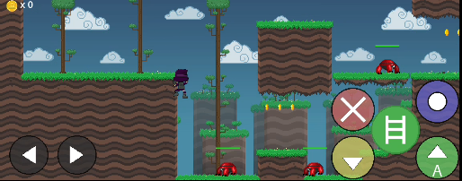

Godot Runner Game

Game platformer 2D yang dibuat menggunakan Godot Engine 4.5 dengan karakter ninja yang dapat berlari, melompat, menyerang, dan meluncur.

Screenshot

Gameplay Awal

Pemain memulai permainan dengan karakter ninja di lingkungan platform. Terdapat enemy kepiting yang harus dikalahkan dan koin emas yang dapat dikumpulkan.

Karakter dapat berinteraksi dengan berbagai platform termasuk jungkat-jungkit (seesaw) untuk mencapai area yang lebih tinggi.

Fitur Game

Kontrol Karakter
• **Bergerak**: Tombol panah kiri/kanan
• **Melompat**: Tombol jump (double jump tersedia)
• **Menyerang**: Tombol attack untuk serangan jarak dekat
• **Melempar**: Tombol shoot untuk melempar kunai
• **Memanjat**: Tombol climb untuk memanjat dinding
• **Meluncur**: Tahan tombol climb saat jatuh untuk gliding

Sistem Combat
• **Ground Attack**: Serangan saat di tanah
• **Jump Attack**: Serangan saat di udara dengan animasi khusus
• **Ranged Attack**: Melempar kunai
• **Jump Throw**: Melempar kunai saat di udara dengan animasi khusus

Sistem Movement
• **Double Jump**: Dapat melompat dua kali di udara
• **Wall Climbing**: Memanjat dinding vertikal
• **Gliding**: Meluncur dengan gravitasi berkurang setelah jatuh minimal 150 pixel
• **Sliding**: Meluncur di tanah

Gameplay Elements
• **Enemy System**: Enemy dengan 3 HP yang spawn coin saat mati
• **Coin Collection**: Kumpulkan koin untuk skor
• **Platform Variety**: Platform bergerak, one-way platform, dan seesaw
• **Physics**: Collision detection yang solid tanpa clipping

Animasi

Game ini memiliki animasi lengkap untuk berbagai aksi:
• Idle, Run, Jump
• Attack, Throw
• Jump Attack (10 frame)
• Jump Throw (10 frame)
• Climb, Glide, Slide
• Dead

Teknologi
• **Engine**: Godot 4.5
• **Bahasa**: GDScript
• **Physics**: RigidBody2D dengan custom integrator
• **Audio**: Sound effects untuk jump, attack, coin collection
• **Graphics**: 2D sprite animations dengan parallax background

Cara Menjalankan
1. Buka Godot Engine 4.5
2. Import project dengan memilih file `project.godot`
3. Tekan F5 atau klik tombol Play untuk menjalankan game

Kontrol Default

Desktop
• **A/D** atau **Arrow Keys**: Bergerak kiri/kanan
• **Space**: Melompat
• **X**: Menyerang
• **C**: Melempar kunai
• **S** atau **Down Arrow**: Slide
• **W** atau **Up Arrow**: Climb/Glide

Mobile

Game dilengkapi dengan on-screen buttons untuk kontrol mobile.

Fitur Khusus

Gliding System
• Aktif setelah jatuh minimal 150 pixel
• Tahan tombol climb untuk mengaktifkan
• Gravitasi berkurang menjadi 30% dari normal
• Berhenti saat menyentuh tanah atau melepas tombol

Combat System
• Enemy membutuhkan 3 hit untuk mati
• Health bar visual pada enemy
• Spawn coin otomatis saat enemy mati
• Attack area detection untuk melee combat

Physics Improvements
• Continuous collision detection untuk mencegah tunneling
• Solid collision tanpa clipping through tiles
• Optimized solver bias untuk collision yang akurat

Credits

Game ini merupakan demo platformer yang menampilkan berbagai fitur Godot Engine untuk game 2D dengan physics-based character controller menggunakan RigidBody2D.